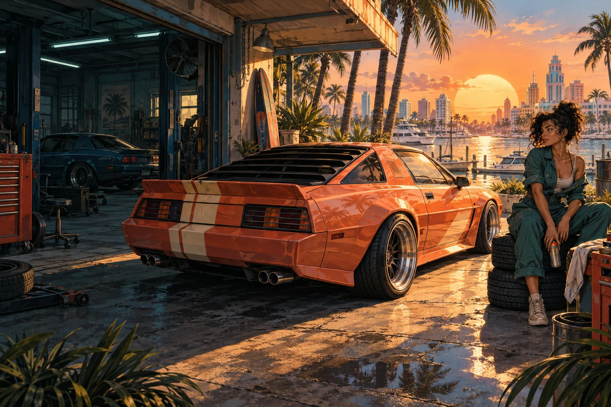

# Sundown Customs

**Paint it. Get made. Repaint your way out.** An original GTA-inspired crime-arcade built around Unlayer's React Image Editor, set in fictional Solana Bay.

[Play Sundown Customs](https://sundown-customs.vercel.app) · [Public source](https://github.com/adityasarade/sundown-customs)



## How Unlayer is used — five layers

1. **Paint Booth (livery).** `src/Editor.tsx` mounts the real `@unlayer/react-image-editor`. `src/editor-contexts.ts` gives it a branded context via Unlayer `translations` — Draw → "Spray can", Text → "Tag", Shapes → "Stencils", Stickers → "Decals", Filter → "Tint", Crop → "Trim", Save → "Fit the wrap", Cancel → "Bail" — plus custom per-tool SVG `icon`s served from `public/icons`. Pre-built original decals from the **Decal Rack** (`src/DecalRack.tsx`, art in `src/decals.ts`) — crew badges, race numbers, fictional sponsors, flair — are composited onto the livery with `composeLivery()` before it opens in the editor.
2. **Crew Emblem Creator (GTA Online–style).** `src/emblem.ts` seeds a 512×512 emblem that opens in its own dark Unlayer context: Stickers → "Symbols", Shapes → "Badge shapes", Text → "Crew name", Save → "Rep the crew". The saved emblem rides on the car roof texture, the driving HUD, the BAYFEED avatar, and the Bay 9 News broadcast crest.
3. **Spray & Pray (mid-chase respray).** A dark context with a live per-pixel change meter polling `getImage()` every 1.4s. Disguise kits (`KITS`/`disguise()` in `src/decals.ts`) are loaded straight into the running editor via the instance `reset(imageUrl)` API. Every 8% of the livery you change drops one wanted star — measured by `src/paint-diff.ts`, a per-pixel colour-delta comparison on a 160×80 sample, with no image recognition involved.
4. **Snappix darkroom.** A photo of the real 3D scene (captured from the live WebGL canvas) opens in a third context: the frame tool relabeled "Borders", Save → "Post to BAYFEED". Saving composes a parody social post (`src/BayFeed.tsx`) with animated likes and a scripted comment thread.
5. **Everything saved is real.** The exact bitmaps you save become Three.js textures on the car (`src/World.tsx` loads the livery onto the hood/doors and the emblem onto the roof), the CCTV still captured from a fixed security-camera angle the moment you go wanted, the Bay PD roadside billboards (`src/poster.ts`'s "HAVE YOU SEEN THIS CAR?" — built from the paint the cameras saw, still hunting your old paint after a respray), and the exported 1600×900 Bay 9 News broadcast (`src/News.tsx`). Nothing on screen is a mock-up of your artwork; it's your artwork.

## The experience

Nico sends you on **"The Last Delivery"**: four checkpoints around a fictional coastal loop, 90 seconds on the clock (`src/driving.ts`). At the north pier the harbour cameras get a clean shot of your paint and you go **WANTED** — up to five stars, three police cruisers that chase you along the exact line you drove (`copPose()` replays your own recorded trail), a helicopter searchlight once you're hot enough, and a BUSTED meter that fills if you stall with a cruiser on your bumper.

Your way out is Spray & Pray: drive into the booth on the east road and the run pauses while Unlayer reopens on your current livery. Repaint it, save, and the stars you shook off are computed from how much of the bitmap actually changed — the more you change, the more heat you lose. Drift through corners for bonus cash; the automatic-throttle option keeps you accelerating while you steer.

A GTA-style HUD tracks stars, cash, the clock, and a radar with a blip for the respray booth. Nico texts you through the run, and dismissible GTA-style help boxes (`src/Guide.tsx`) introduce the garage, the paint booth, the drive, being wanted, Spray & Pray, and photo mode the first time each appears. Loading screens between phases show original chase/respray/cover art and rotate short gameplay tips. Finish, get busted, or run out of time, and MISSION PASSED / BUSTED / MISSION FAILED all land with their own splash, payout breakdown (wanted stars dropped, stars still on you, drift cash, scrapes and rams), and personal-best tracking for this browser.

From there: Bay 9 News airs the story (satirical anchor copy, the real CCTV still, a before/after paint comparison stamped with the measured change percentage, a scrolling ticker) and you can save the broadcast as a PNG. Then photo mode, a second Unlayer pass on your captured 3D shot in the Snappix darkroom, a BAYFEED post, and a downloadable run card.

Three synthesized radio stations (Coastline FM, Non-Stop Neon, Bay Talk) plus a siren and stinger cues are generated in the browser with the Web Audio API — off by default, on via the radio toggle or **R** while driving.

## Original art note

Everything is original work: a fictional Solana Bay, an authored coupe, procedural low-poly architecture, generated illustrations for the cover/chase/respray/anchor art and Nico, hand-drawn canvas decals and crew badges, a synthesized radio bed and siren, and parody news/social copy — no real brands, franchises, or people.

## Controls

| Action | Desktop | Touch |
| --- | --- | --- |
| Accelerate / brake | W / S or up / down | Gas pedal / brake-drift pedal |
| Steer | A / D or left / right | Left / right buttons |
| Drift | Space (or brake) while steering at speed | Brake-drift pedal + steer |
| Boost | Shift while accelerating | Lightning button |
| Change radio station | R | Station tap (in-run tuner) |
| Pause | Escape or pause button | Pause button |
| Inspect / frame car | Drag the scene | Drag horizontally |

An optional automatic throttle keeps the car accelerating while the player steers; brake still interrupts it. Leaving the tab pauses the run. Motion is reduced when the browser preference requests it. Sound starts only after the radio toggle is pressed.

The mobile editor reflows the real native tool settings beneath the canvas and labels its icon-only Save/Cancel actions (`src/editor-accessibility.ts`). No replacement drawing tool is used — it's the native Unlayer editor throughout.

## Testing

- **Unit tests** (`npm test`, `node --experimental-strip-types --test tests/*.test.ts`): 15 tests covering the pure driving logic in `tests/driving.test.ts` (the coastal loop, timing, drift and collision accounting, heading wrap, wanted/heat thresholds, respray star math, the BUSTED bust-meter, cop pursuit) and the Unlayer save gate in `tests/editor-gate.test.ts` (rejecting unedited saves, accepting real edits, and never blocking a save when the runtime's change signals are ambiguous).
- **End-to-end** (`npm run test:e2e`, or `npm run test:e2e:mobile` for the mobile viewport): `tests/e2e/flow.mjs` drives the whole game once in a real Chromium browser against the real (non-mocked) Unlayer runtime — home → garage → decal rack → paint booth (Tint → Invert → Fit the wrap) → delivery briefing → drive → going wanted → Spray & Pray → finishing the run → the news broadcast → photo mode → Snappix → BAYFEED — and saves screenshots to `test-results/e2e`.

## Run locally

Use Node 22.13+ (Node 25 was used during development).

```sh
npm ci
npm run dev
npm test
npm run test:e2e
npm run build
```

Open `http://127.0.0.1:5188`. Vercel serves the static `dist` directory. There is no server, secret, runtime AI call, login, or API key to configure.

## Storage and dependencies

The latest livery, callsign, crew emblem, underglow, and personal best are stored in this browser's local storage. Captured CCTV stills, photographs, and run state live in memory only. Storage failure does not prevent the current session from working. **New build** clears the fitted livery. No analytics or application backend is present.

The hosted Unlayer runtime and its assets require a network connection. Google Fonts are requested with local font fallbacks. WebGL is required for the 3D world; an explicit error is shown when unavailable. The app requests no physical camera, microphone, or location permissions — photo mode and the CCTV still both capture the game's own WebGL canvas.

See [verification](docs/verification.md), [asset provenance](docs/provenance.md), [competition strategy](docs/competition-strategy.md), and the [submission kit](docs/submission-kit.md).
